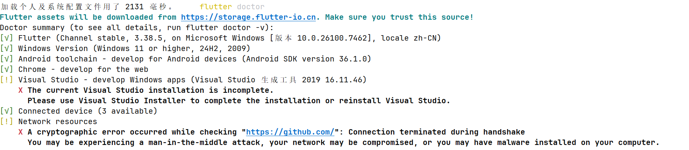
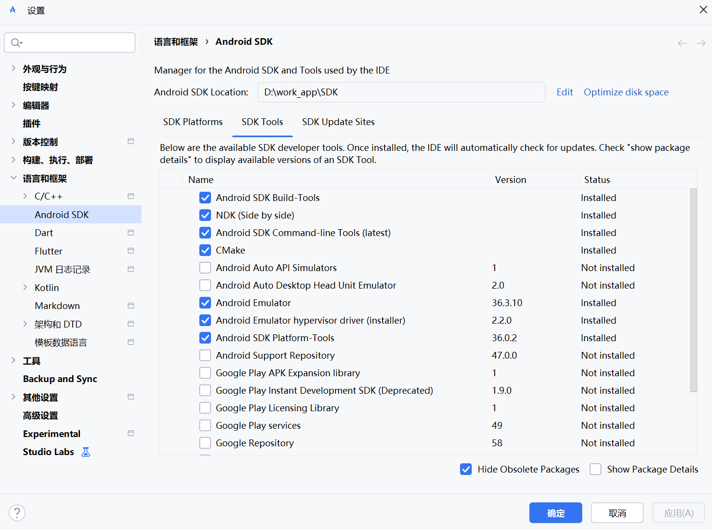

# 🚀 队友首次运行指南

---

## 🔧 步骤1：克隆项目

```bash
git clone https://github.com/DylanJuly/lingjing-frontend.git
cd project
```

---

## 📦 步骤2：安装依赖

```bash
flutter pub get
```

---

## ⚙️ 步骤3：配置本地环境

### 自动配置（推荐）

直接运行项目，Flutter会自动生成 `android/local.properties`。

### 手动配置（如果自动失败）

创建/编辑 `android/local.properties`：

```properties
sdk.dir=[你的Android SDK路径]
flutter.sdk=[你的Flutter SDK路径]
```

**示例**：
```properties
sdk.dir=C:\\Users\\你的用户名\\AppData\\Local\\Android\\Sdk
flutter.sdk=D:\\work_app\\flutter
```

---

## ✅ 步骤4：验证环境

```bash
# 检查环境
flutter doctor

# 应该看到：
# [√] Flutter
# [√] Android toolchain
# [√] Chrome
```



如果Android toolchain有问题：
```bash
# 接受许可证
flutter doctor --android-licenses
# 全部输入 y
```

---

## 🚀 步骤5：运行应用（运行前看下面的图片是不是一样，打钩的都必须下载）

```bash
# 查看可用设备
flutter devices

# 运行到Android设备/模拟器
flutter run -d 【android（你的模拟器id】
```

---

## ⚠️ 常见问题



### 问题1：找不到SDK

**解决**：在 `android/local.properties` 中设置正确的 `sdk.dir`

### 问题2：NDK未找到

**解决**：在Android Studio的SDK Manager中安装NDK 29.0.14206865

### 问题3：CMake未找到

**解决**：在Android Studio的SDK Manager中安装CMake

### 问题4：依赖下载失败（要挂梯子）

**解决**：检查网络，或使用代理/VPN

---

## 📝 快速检查清单

- [ ] 已安装Flutter 3.38.5
- [ ] 已安装Android Studio 2025.2.2.8
- [ ] 已安装Android SDK 36.1.0
- [ ] 已安装Android NDK 29.0.14206865
- [ ] 已安装CMake 4.1.2
- [ ] 已设置ANDROID_HOME环境变量
- [ ] 已运行 `flutter pub get`
- [ ] 已接受Android许可证
- [ ] 已运行 `flutter doctor` 验证
- [ ] 可以运行 `flutter run`

---

**按照以上步骤，应该就能成功运行项目了！** 🎉

